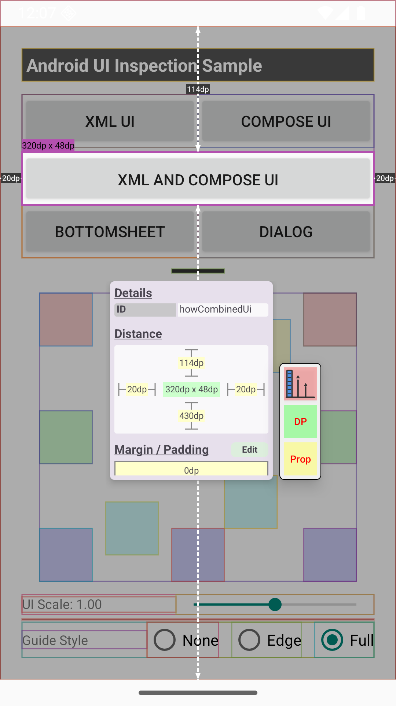
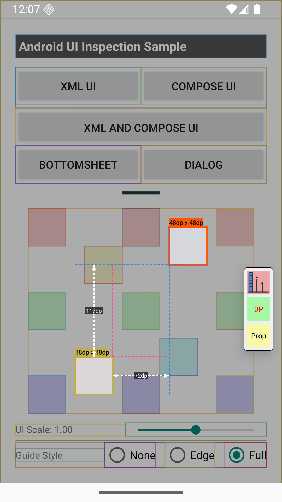
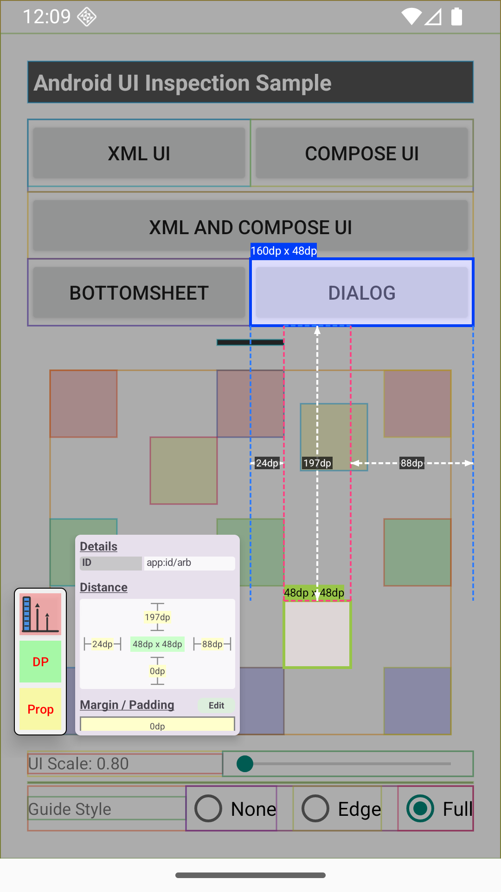

# UI Inspector

**UI Inspector**는 안드로이드 개발 중 UI 레이아웃 요소를 시각적으로 검사할 수 있는 디버깅 오버레이 라이브러리입니다.

이 프로젝트는 현재는 종료된 **Window VQA** 앱의 UI 검사(측정) 기능에서 영감을 받았습니다.

**디버그 빌드 전용**으로 사용되며, **no-op 모듈**이 함께 제공되어 릴리즈 빌드에서는 코드가 포함되지 않고 성능에도 영향을 주지 않습니다.

| 스크린샷 1                              | 스크린샷 2                              | 스크린샷 3                              |
|:----------------------------------------| :-------------------------------------- |:----------------------------------------|
|  |  |  |

---

## 주요 기능

### 일반 검사 모드

- 검사 기능을 활성화하면 선택 가능한 UI 요소에 외곽선이 표시됩니다.
- 요소를 탭하면 다음 정보가 표시됩니다:
    - 해당 요소의 **가로 및 세로 크기**
    - **즉시 상위 뷰와의 거리** (위, 아래, 왼쪽, 오른쪽)
    - 모든 정보는 화면 위에 오버레이 형태로 나타납니다.

### 상대 검사 모드

- 선택 가능한 요소를 길게 누르면 상대 검사 모드가 활성화됩니다.
- 첫 번째 선택한 요소는 **빨간색**, 두 번째 요소는 **파란색**으로 강조 표시됩니다.
- 두 요소 간의 거리(위, 아래, 왼쪽, 오른쪽)가 각각 표시됩니다.
    - **거리가 0인 방향은 표시되지 않습니다.**

### 뷰 시스템 호환성

- 다음 UI 트리 구조를 모두 지원합니다:
    - 전통적인 `XML` 기반 UI
    - `Jetpack Compose` 기반 UI

---

## Compose 제약사항

**Compose** 환경에서는 **SemanticsNode**를 통해 UI 요소를 추출합니다. 따라서 컴포저블 선언 시 Semantics를 생성하지 않는 노드는 선택 가능한 요소로 표시되지 않습니다. 아래 예시와 같이 SemanticsNode가 생성되도록 코드를 구성해야 합니다:

```kotlin
@Composable
fun Profile(profile: Profile, modifier: Modifier) {
  Box(
    modifier = Modifier
      .clearAndSetSemantics {} // 또는 .semantics {}
      .size(100.dp)
      ..
  ) {
      Image(
        painter = painterResource(id = R.drawable.ic_profile_placeholder),
        contentDescription = "profile holder", // 옵션 1
        modifier = Modifier
          // 또는 .clearAndSetSemantics {}      // 옵션 2
          // 또는 .semantics {}                 // 옵션 3
          .fillMaxSize(),
        contentScale = ContentScale.Crop
      )
      ..
  }
}
```

---

## 권한

이 라이브러리는 오버레이 UI를 표시하기 위해 **"다른 앱 위에 그리기"** 권한이 필요합니다.
먼저 **당신의 앱**에 다른 앱 위에 권한을 사용하도록 추가해야 합니다. `AndroidManifest.xml`에 아래 권한을 추가합니다.
(debug용 `AndroidManifest.xml` 을 추가로 구성하면 상용 버전에 권환이 포함되지 않도록 할 수 있습니다.)

```xml
<?xml version="1.0" encoding="utf-8"?>
<manifest>
  <uses-permission android:name="android.permission.SYSTEM_ALERT_WINDOW" />
  ..
</manifest>
```

앱 설치 후에 이 권한을 UI 요소 검사 수행 전에 앱 권한으로 부여해야 합니다. 
(설정 > 애플리케이션 > 당신의 앱 > 다른 앱 위에 표시)

---

## 다운로드

Maven Central을 통해 다음 의존성을 추가하세요:

```kotlin
dependencies {
  debugImplementation("io.github.uhufor:inspector-runtime:latest.release")
  releaseImplementation("io.github.uhufor:inspector-noop:latest.release")
}
```

---

## 예제 코드

```kotlin
class InspectorApplication : Application() {
    override fun onCreate() {
        super.onCreate()
        // 사용 전 설치가 필요합니다
        Inspector.install(this)
        // 기본 제공되는 플로팅 버튼을 사용하려는 경우 (선택)
        Inspector.showFloatingTrigger()
    }
}

// 검사 기능을 수동으로 제어하고 싶을 경우
class InspectorActivity : Activity() {
    fun enableInspection() {
        Inspector.enableInspection()
    }

    fun disableInspection() {
        Inspector.disableInspection()
    }
}
```

---

## 라이선스

```
Copyright [2025] [uhufor (김해중)]

Licensed under the Apache License, Version 2.0 (the "License");
you may not use this file except in compliance with the License.
You may obtain a copy of the License at

    http://www.apache.org/licenses/LICENSE-2.0

Unless required by applicable law or agreed to in writing, software
distributed under the License is distributed on an "AS IS" BASIS,
WITHOUT WARRANTIES OR CONDITIONS OF ANY KIND, either express or implied.
See the License for the specific language governing permissions and
limitations under the License.
```
