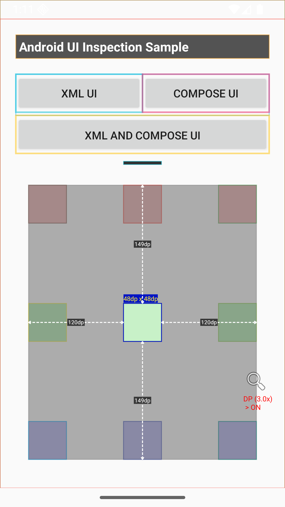
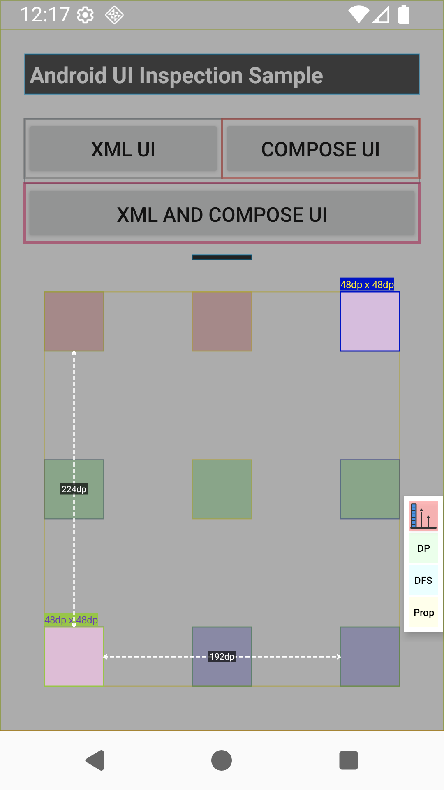
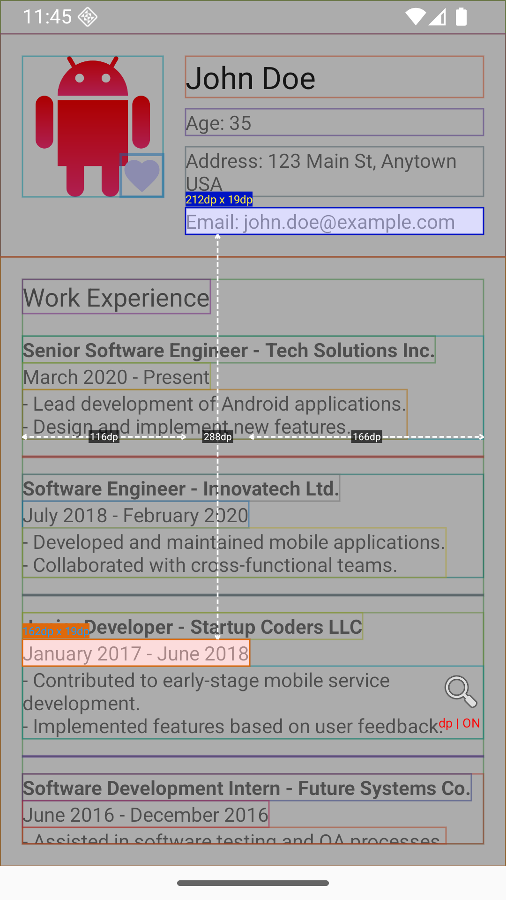
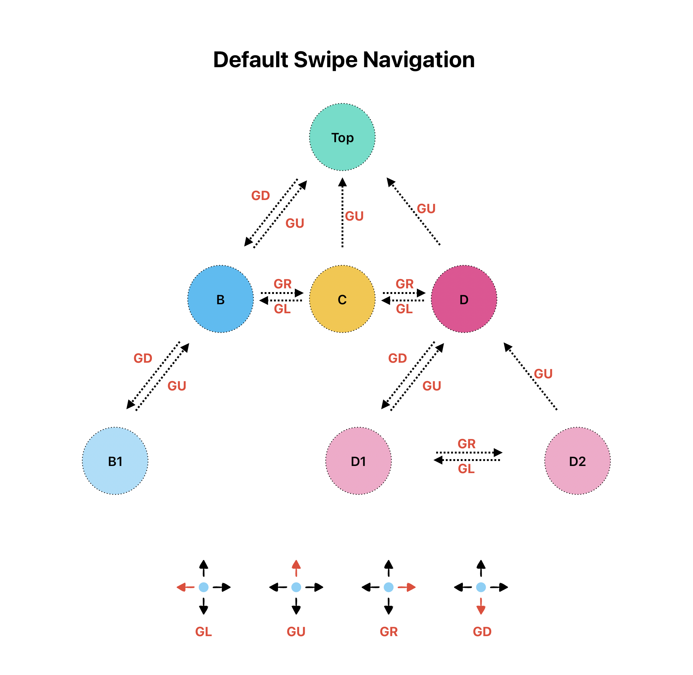
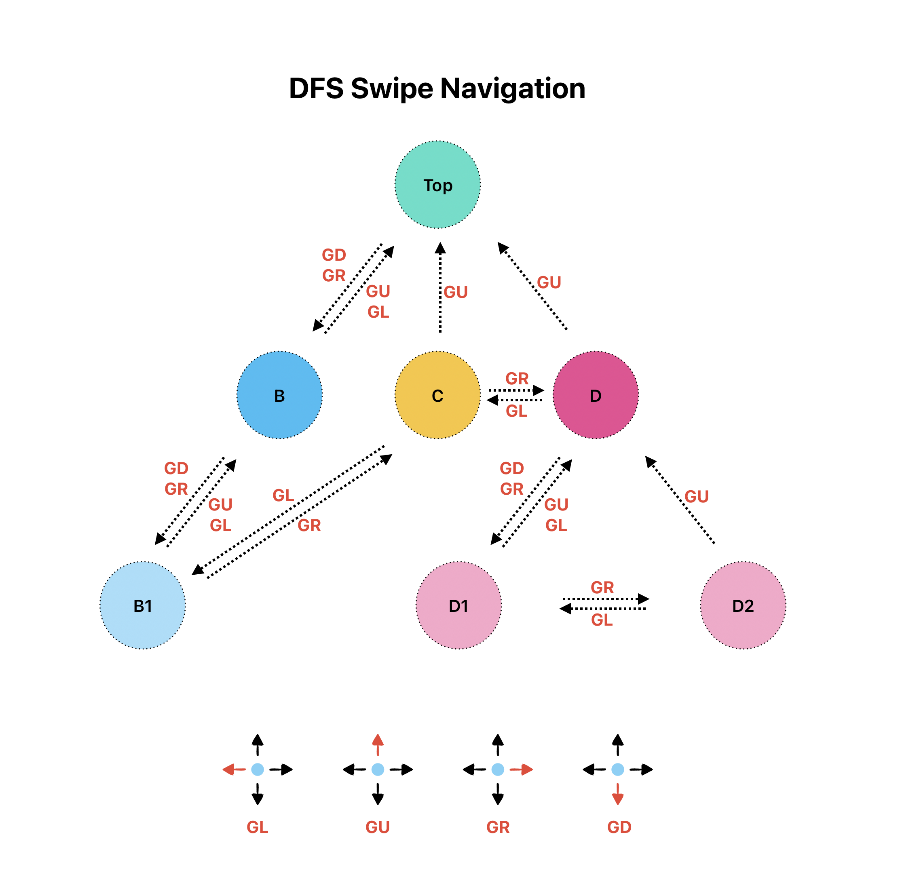

# UI Inspector

**UI Inspector** is a debugging overlay library for <u>Android</u> that allows developers to visually
inspect layout elements during development.

This project is inspired by the UI inspection (measurement) function of the now-<u>defunct</u> **Window VQA** app.

It is intended for **debug builds only**, and a corresponding **no-op module** ensures no overhead
or code inclusion in release builds.

| Screenshot 1                            | Screenshot 2                            | Screenshot 3                            |
|:----------------------------------------| :-------------------------------------- |:----------------------------------------|
|  |  |  |

---

## Features

### Standard Inspection Mode

- When enabled, all selectable UI elements are highlighted with outlines.
- Tapping an element displays:
    - The element’s **width and height**
    - Its **distance from the immediate parent view** (top, bottom, left, right)
    - All data is shown as an overlay on the screen.

### Relative Inspection Mode

- Long-pressing a selectable element activates relative inspection mode.
- The first selected element is highlighted in **red**, and the second in **blue**.
- The distance between the two elements is shown for each side (top, bottom, left, right).
    - Sides with **zero distance are not shown**

### View System Compatibility

- Supports both:
    - Traditional `XML`-based UI trees
    - `Jetpack Compose` UI trees

---

## Compose Constraints

Since **SemanticsNode** is used for UI element extraction in **Compose**, any node that does not generate semantics during declaration will not be selectable. In such cases, make sure semantics are generated, as shown in the code below:

```kotlin
@Composable
fun Profile(profile: Profile, modifier: Modifier) {
  Box(
    modifier = Modifier
      .clearAndSetSemantics {} // or .semantics {}
      .size(100.dp)
      ..
  ) {
      Image(
        painter = painterResource(id = R.drawable.ic_profile_placeholder),
        contentDescription = "profile holder", // Option 1
        modifier = Modifier
          // or .clearAndSetSemantics {}       // Option 2
          // or .semantics {}                  // Option 3
          .fillMaxSize(),
        contentScale = ContentScale.Crop
      )
      ..
  }
}
```

---

## Permissions

This library requires the **“Draw over other apps”** permission to display the overlay UI.

First, you need to declare this permission in <u>your app</u> to allow drawing over other apps.
Add the following to your `AndroidManifest.xml` file:
(You can also place it in a <u>debug-specific manifest</u> to avoid including it in release builds.)

```xml
<?xml version="1.0" encoding="utf-8"?>
<manifest>
  <uses-permission android:name="android.permission.SYSTEM_ALERT_WINDOW" />
  ..
</manifest>
```

After installing the app, this permission must be granted before performing any UI inspection.
(Settings > Apps > Your App > Display over other apps)

---

## Additional feature

### Swipe Gesture Navigation

In measurement mode, when the target UI element is too small to select easily, swipe gesture navigation can help make selection easier. After activating the inspection feature, select any UI element. Then, by swiping in any of the four directions—up, down, left, or right—the selected element changes based on the swipe direction. Two types of view tree navigation methods are supported.

The default is the **Hierarchy** mode, which allows intuitive navigation through parent, child, and sibling nodes. For example, swiping to the right moves through sibling nodes sequentially. When the last sibling node is reached, no further movement occurs.

The other type is **DFS (Depth-First Search)** mode, which navigates the view tree using pre-order traversal. For instance, swiping to the right does not move to a sibling node but instead first traverses the child nodes of the current node, and then continues to the next sibling.

|           Hierachy (Default)            |                   DFS                   |
| :-------------------------------------: | :-------------------------------------: |
|  |  |

The diagram illustrates how the tree navigation changes according to the swipe gesture direction. For example, In DFS mode, moving from Top → B can be done using either the GD or GR swipe gestures. **GD** is a shorthand for Gesture Down.

---

## Download

Add the following dependencies from Maven Central:

```kotlin
dependencies {
  debugImplementation("io.github.uhufor:inspector-runtime:latest.release")
  releaseImplementation("io.github.uhufor:inspector-noop:latest.release")
}
```

## Example

```kotlin
class InspectorApplication : Application() {
    override fun onCreate() {
        super.onCreate()
        // Install before using
        Inspector.install(this)
        // To use the default floating control button (Option)
        Inspector.showFloatingTrigger()
    }
}

// For manual control of inspection
class InspectorActivity : Activity() {
    fun enableInspection() {
        Inspector.enableInspection()
    }

    fun disableInspection() {
        Inspector.disableInspection()
    }
}
```

## License

```
Copyright [2025] [uhufor (Hae Jung, Kim)]

Licensed under the Apache License, Version 2.0 (the "License");
you may not use this file except in compliance with the License.
You may obtain a copy of the License at

    http://www.apache.org/licenses/LICENSE-2.0

Unless required by applicable law or agreed to in writing, software
distributed under the License is distributed on an "AS IS" BASIS,
WITHOUT WARRANTIES OR CONDITIONS OF ANY KIND, either express or implied.
See the License for the specific language governing permissions and
limitations under the License.
```
